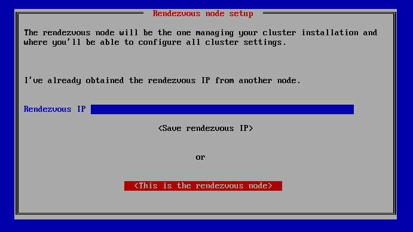
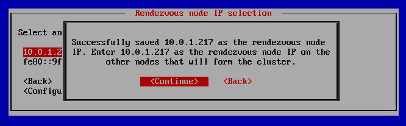
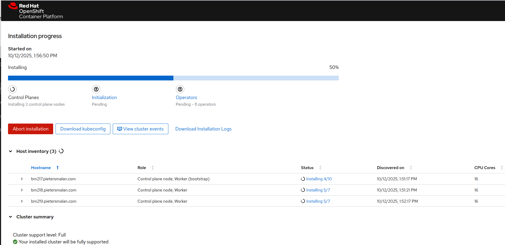
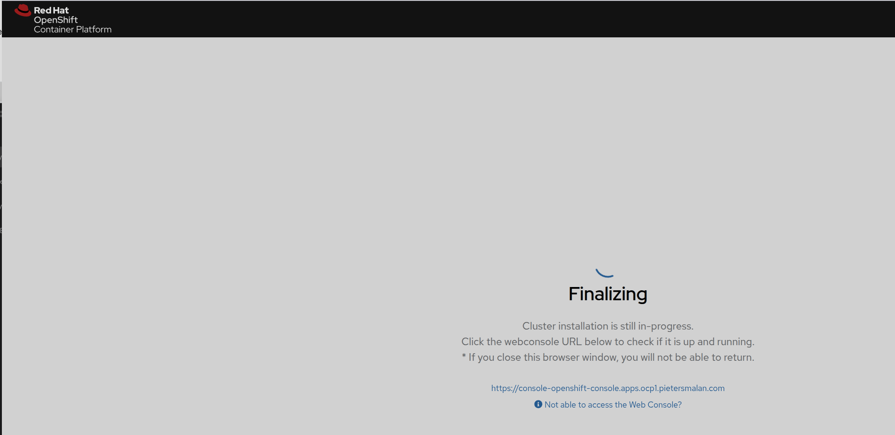

:toc2:

== Assisted Installer Disconnected

This document describes how to install OpenShift using the Assisted Installer in a disconnected environment.

WARNING: This is still in Developer Preview as of OpenShift 4.19.14, however the cluster installed would be full supported.

=== Prerequisites

ISO image downloaded from Red Hat Hybrid Cloud Console - https://console.redhat.com/openshift/assisted-installer/clusters/~new and select checkbox "I'm installing on a disconnected/air-gapped/secured environment".

Click next on the summary page, and you will see the "Download ISO" button.

Download the using the "Download ISO" button.

NOTE: At the moment the ISO image is only catering for the Openshift Virt Operators. For other operators, you will need to add them post install, using a mirror registry.

=== Cluster Install

==== Boot the ISO image on the first node

Boot the ISO image on the first node. This node will be assigned as the "rendezvous" node.

After the boot process, you will see a screen similar to below:

Select the "This is the rendezvous node"

Select the correct IP address, and confirm to start the services.

Wait until the services are started, and access the URL shown on the screen.

image::images/assisted-installer-ready.png[Assisted Installer Ready]

==== Create the cluster using the Assisted Installer UI

Access the URL shown on the screen, and supply the necessary information to create the cluster wizard.

NOTE: The rendezvous node will be automatically added as the first master node.

On the Host Discovery step, start the other nodes, using the same ISO image, and specify the rendezvous node IP address when asked.

When all nodes are showing, and all nodes are in "Ready" state, you can start the installation. 

Wait until you see the following page, and click on the console:

NOTE: At this point the cluster is fully functional, and you can access the cluster using the kubeadmin password downloaded during the cluster creation step. Login on into console using kubeadmin and the password contained in the kubeadmin file.

=== Post Install

==== Update Mirror Registry Configuration

.Delete installer registry settings
[source,bash]
----
oc delete idms --all
oc delete itms --all
----

Add Mirror Registry Configuration

NOTE: See link:/Installation/Disconnected/Mirrorv2.adoc[Mirror Registry Configuration] for more details on how to configure a mirror registry. The image set yamls, will be available in the "working-dir", after the mirroring process is completed.

.imageTagMirrorSet.yaml
[source,yaml]
----
apiVersion: config.openshift.io/v1
kind: ImageTagMirrorSet
metadata:
  name: quay-tag-mirror
spec:
  imageTagMirrors:
    - mirrorSourcePolicy: AllowContactingSource
      mirrors:
        - quay.pietersmalan.com/cachequayio
      source: quay.io
    - mirrorSourcePolicy: AllowContactingSource
      mirrors:
        - quay.pietersmalan.com/registryredhatiocache
      source: registry.redhat.io
    - mirrorSourcePolicy: AllowContactingSource
      mirrors:
        - quay.pietersmalan.com/dockeriocache
      source: docker.io
----

.imageDigestMirrorSet.yaml
[source,yaml]
----
apiVersion: config.openshift.io/v1
kind: ImageDigestMirrorSet
metadata:
  name: quay-digest-mirror
spec:
  imageDigestMirrors:
    - mirrorSourcePolicy: AllowContactingSource
      mirrors:
        - quay.pietersmalan.com/cachequayio
      source: quay.io
    - mirrorSourcePolicy: AllowContactingSource
      mirrors:
        - quay.pietersmalan.com/registryredhatiocache
      source: registry.redhat.io
    - mirrorSourcePolicy: AllowContactingSource
      mirrors:
        - quay.pietersmalan.com/dockeriocache
      source: docker.io
----

==== Patch Operator Hub to enable operators to use the mirror registry.

.cluster.yaml
[source,yaml]
----
apiVersion: config.openshift.io/v1
kind: OperatorHub
metadata:
  name: Cluster
spec: {}
----

==== Allow upgrades

NOTE: If you want to allow upgrades, as the cluster is disconnected, you will need populate the mirror registry with the necessary images. 

To allow upgrades, you will need to patch the FeatureGate to allow automatic updates.

.feature-gate.yaml
[source,yaml]
----
apiVersion: config.openshift.io/v1
kind: FeatureGate
metadata:
  name: cluster
spec:
  customNoUpgrade:
    disabled:
      - NoRegistryClusterOperations
  featureSet: CustomNoUpgrade
