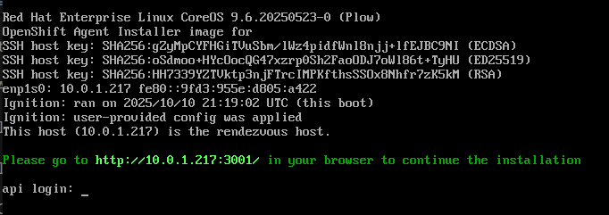

== Assisted Installer Disconnected

This document describes how to install OpenShift using the Assisted Installer in a disconnected environment.

WARNING: This is still in Developer Preview as of OpenShift 4.19.14, however the cluster installed would be full supported.

=== Prerequisites

ISO image downloaded from Red Hat Hybrid Cloud Console - https://console.redhat.com/openshift/assisted-installer/clusters/~new and select checkbox "I'm installing on a disconnected/air-gapped/secured environment".

Click next on the summary page, and you will see the "Download ISO" button.

Download the using the "Download ISO" button.

NOTE: At the momnent the ISO image is only catering for the Openshift Virt Operators. For other operators, you will need to add them post install, using a mirror registry.

=== Cluster Install

==== Boot the ISO image on the first node

Boot the ISO image on the first node. This node will be assigned as the "rendezvous" node.

After the boot process, you will see a screen similar to below:

image::./images/roundezvous-boot.png[Assisted Installer booted]

Select the "This is the rendezvous node"

Select the correct IP address, and confirm to start the services.

image::ready_start_services.png[Start Services]

Wait until the services are started, and access the URL shown on the screen.

==== Create the cluster using the Assisted Installer UI

Access the URL shown on the screen, and supply the necessary information to create the cluster wizard.

NOTE: The rendezvous node will be automatically added as the first master node.

On the Host Discovery step, start the other nodes, using the same ISO image, and specify the rendezvous node IP address when asked.

When all nodes are showing, and all nodes are in "Ready" state, you can start the installation. 

