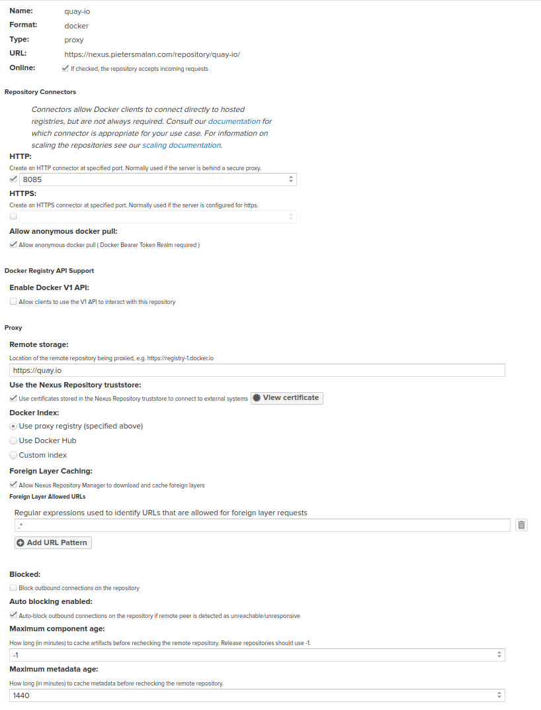
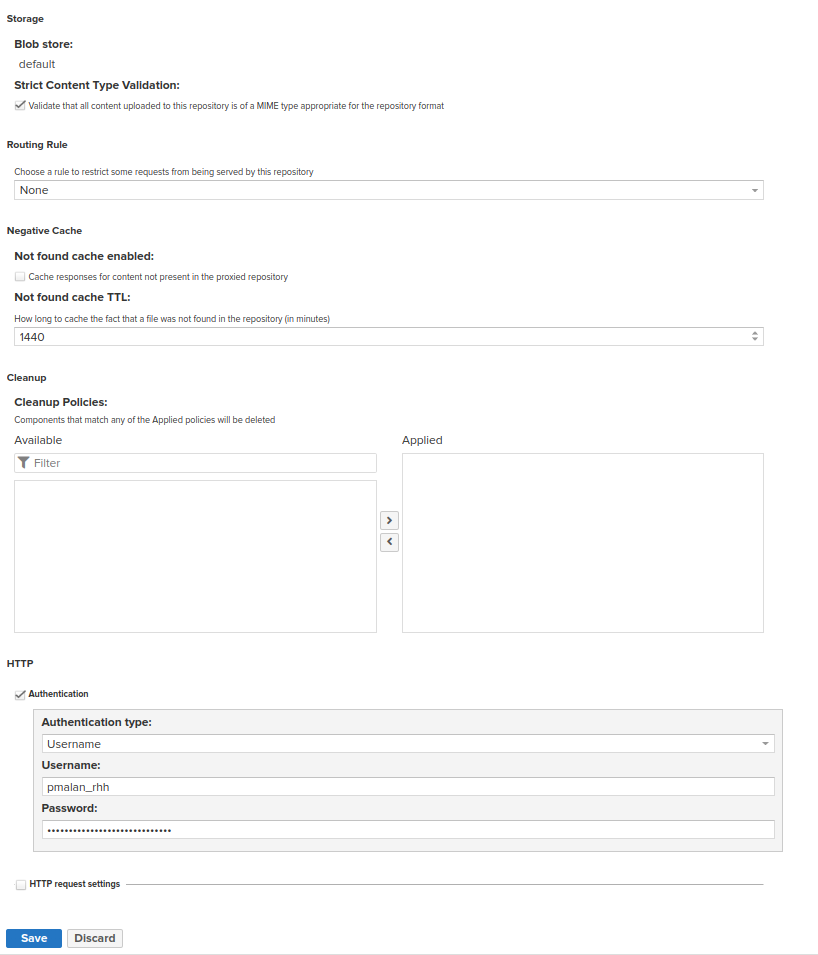
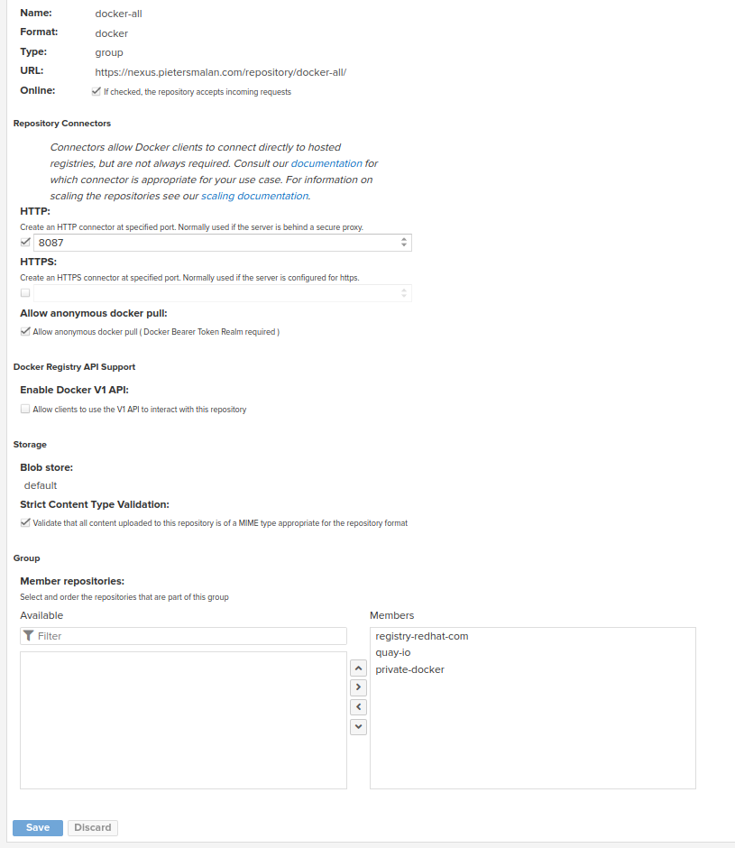

== Nexus pull through cache/proxy Docker Registry

=== Nexus Configuration

=== Create a Docker Proxy Registry

TIP: See https://access.redhat.com/terms-based-registry/#/ for username / password

=== Create a Docker Group Registry

Create a docker group to expose all the docker registries on a single entry point.

=== Add Docker Proxy to Docker Hub

.imageDigestMirrorSet.yaml
[source,yaml]
----
apiVersion: config.openshift.io/v1
kind: ImageDigestMirrorSet
metadata:
  name: nexus-mirror
spec:
  imageDigestMirrors:
    - mirrorSourcePolicy: AllowContactingSource
      mirrors:
        - 'nexus.pietersmalan.com:5087'
      source: registry.redhat.io
    - mirrorSourcePolicy: AllowContactingSource
      mirrors:
        - 'nexus.pietersmalan.com:5087'
      source: quay.io
----