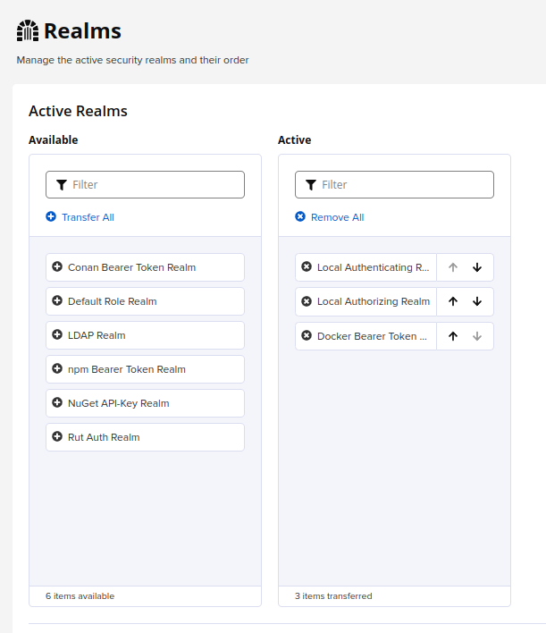

== Nexus pull through cache/proxy Docker Registry

=== Nexus Configuration

==== Create a Docker Proxy Registry
image::images/nexus_proxy1.png[]
image::images/nexus_proxy2.png[]

TIP: See https://access.redhat.com/terms-based-registry/#/ for username / password

TIP: Be sure to click _Allow anonymous docker pull_

==== Create a Docker Group Registry

Create a docker group to expose all the docker registries on a single entry point.

image::images/nexus_proxy3.png[]

==== Configure Nexus Realms

Add Docker Bearer Token to Active Realms.

==== Configure SSL

Easiest way to configure SSL for Nexus is to front it by *nginx*. Replace cert.crt and cert.key with a valid certificate, and update IP address to reflect Nexus' IP.

.Sample nginx.conf
[source]
----
user nginx;
worker_processes 1;

error_log /var/log/nginx/error.log warn;
pid /var/run/nginx.pid;

events {
worker_connections 1024;
}

http {

proxy_send_timeout 120;
proxy_read_timeout 300;
proxy_buffering off;
keepalive_timeout 5 5;
tcp_nodelay on;

server {
  listen *:5087;
  server_name 10.0.1.175;

  ssl_certificate /etc/ssl/certs/cert.crt;
  ssl_certificate_key /etc/ssl/certs/cert.key;

  # allow large uploads of files
  client_max_body_size 1G;
  ssl on;

  # optimize downloading files larger than 1G
  #proxy_max_temp_file_size 2G;

  location / {
      # Use IPv4 upstream address instead of DNS name to avoid attempts by nginx to use IPv6 DNS lookup
      proxy_pass http://10.0.1.175:8087/;
      proxy_set_header Host $host;
      proxy_set_header X-Real-IP $remote_addr;
      proxy_set_header X-Forwarded-Host $host:$server_port;
      proxy_set_header X-Forwarded-Server $host;
      proxy_set_header X-Forwarded-For $proxy_add_x_forwarded_for;
      proxy_set_header X-Forwarded-Proto "https";
  }
}
}
----

=== Configure Openshift to use cache/proxy registry

.imageDigestMirrorSet.yaml
[source,yaml]
----
apiVersion: config.openshift.io/v1
kind: ImageDigestMirrorSet
metadata:
  name: nexus-mirror
spec:
  imageDigestMirrors:
    - mirrorSourcePolicy: AllowContactingSource
      mirrors:
        - 'nexus.pietersmalan.com:5087'
      source: registry.redhat.io
    - mirrorSourcePolicy: AllowContactingSource
      mirrors:
        - 'nexus.pietersmalan.com:5087'
      source: quay.io
----

.imageTagMirrorSet,yaml
[source,yaml]
----
apiVersion: config.openshift.io/v1
kind: ImageTagMirrorSet
metadata:
  name: nexus-mirror
spec:
  imageTagMirrors:
    - mirrorSourcePolicy: AllowContactingSource
      mirrors:
        - 'nexus.pietersmalan.com:5087'
      source: registry.redhat.io
    - mirrorSourcePolicy: AllowContactingSource
      mirrors:
        - 'nexus.pietersmalan.com:5087'
      source: quay.io
----
